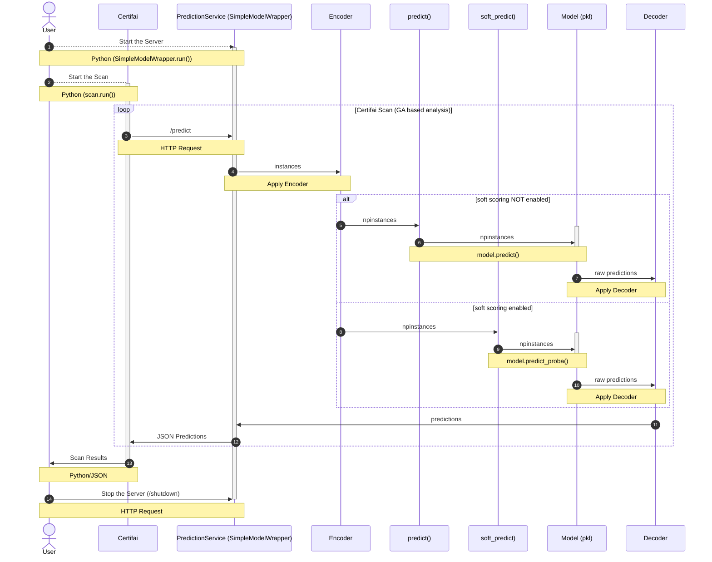

# Cortex Certifai Models

The *models* folder contains examples of using the Certifai Model SDK to wrap trained models in a prediction service
that can be scanned using the Certifai scanner CLI. See the *notebooks* folder for examples of scanning models in a
Jupyter notebook using the Certifai API.

## Certifai Documentation

Refer to the [Cortex Certifai documentation](https://cognitivescale.github.io/cortex-certifai/docs/about)
for detailed information about Cortex Certifai.

## Models Table of Contents

| Model Folder                                                                                       | Description                                                                                                                                                                                                  | Task Type                  | Language | Model Framework        |
|----------------------------------------------------------------------------------------------------|--------------------------------------------------------------------------------------------------------------------------------------------------------------------------------------------------------------|----------------------------|----------|------------------------|
| [containerized_model](./containerized_model)                                                       | Provides a template for containerizing prediction services                                                                                                                                                   |                            |          | python, H2O MOJO       |
| [german_credit](./german_credit)                                                                   | Illustrates using the Certifai Model SDK to run a single (hard or soft-scoring) model in a service or to run multiple models in a service. Also shows scanning a model within a python script using the API. | Binary classification      | python   | sklearn                |
| [german_credit_pandas](./german_credit_pandas)                                                     | Illustrates using the Certifai Model SDK to run a models in a service, where the models expects as input a [pandas DataFrame](https://pandas.pydata.org/) instead of a [numpy array](https://numpy.org/).    | Binary classification      | python   | sklearn                |
| [h2o_dai_auto_insurance](./h2o_dai_regression_auto_insurance)                                      | Illustrates using the Certifai Model SDK to create a gunicorn prediction service from a regression H2O MOJO model, and scan it for trust scores.                                                             | Regression                 | python   | H2O MOJO               |
| [h2o_dai_german_credit](./h2o_dai_german_credit)                                                   | Illustrates using the Certifai Model SDK to create a development or gunicorn prediction service from a binary classification H2O MOJO, and scan it for trust scores or for explanations.                     | Binary classification      | python   | H2O MOJO               |
| [iris](./iris)                                                                                     | Illustrates using the Certifai Model SDK to run a single multi-class model in a service, using a customized model wrapper                                                                                    | Multi-class classification | python   | sklearn   xgboost |
| [r-models](https://github.com/CognitiveScale/cortex-certifai-examples/tree/master/models/r-models) | Illustrates running a R model in a service using plumber                                                                                                                                                     | Binary classification      | R        | randomForest           |

### Sequence diagram

The following diagram shows the flow of data when using the Certifai Model SDK in context of a local scan with
the Certifai toolkit.

Takeaways:

* The user explicitly starts & stops the prediction service.
* If the Prediction Service supports soft scoring (`supports_soft_scores=True`), then soft scores will be returned by
  the server and by default requests get delegated to the model's `predict_proba()` method.
* If the Prediction Service does not support soft scoring, then and by default requests get delegated to the
  model's `predict()` method.
* The **Encoder** transforms data coming into the Prediction Service to match the expected input of the model.
* The **Decoder** transforms the output of the model, before being sent by the Prediction Service.
* Arrows labeled with `npinstances` have the prediction input (`instances`) represented as a [numpy array](https://numpy.org/)
  (`npinstances`).

  NOTE: The data doesn't necessarily have to be given to the model as a `numpy` array.
